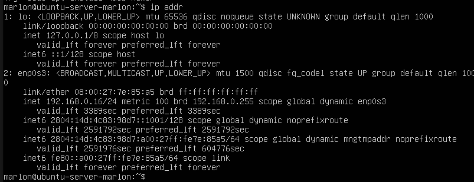

# Linux Onboarding: usando a CLI de uma forma rápida e prática

Link do plano de estudos no Notion: [Começando com Linux](https://www.notion.so/Come-ando-com-Linux-e85f55cfa575463d85245b2524193150?pvs=21)

## Sumário

- [Linux Onboarding: usando a CLI de uma forma rápida e prática](#linux-onboarding-usando-a-cli-de-uma-forma-rápida-e-prática)
  - [Sumário](#sumário)
  - [Antes de começar](#antes-de-começar)
  - [Por que aprender Linux e quais as principais distribuições?](#por-que-aprender-linux-e-quais-as-principais-distribuições)
  - [VirtualBox](#virtualbox)
  - [Acesso via SSH](#acesso-via-ssh)
  - [Conhecendo o WSL](#conhecendo-o-wsl)
  - [SSH no Windows](#ssh-no-windows)
  - [Navegando no sistema PWD e LS](#navegando-no-sistema-pwd-e-ls)
  - [Hierarquia no filesystem - FHS](#hierarquia-no-filesystem---fhs)
  - [Atalhos para navegação](#atalhos-para-navegação)
  - [Criando diretórios com o MKDIR](#criando-diretórios-com-o-mkdir)
  - [Removendo diretórios e arquivos - RMDIR E RM](#removendo-diretórios-e-arquivos---rmdir-e-rm)
  - [Copiando arquivos com o CP](#copiando-arquivos-com-o-cp)
  - [Movendo e renomeando com o Mv](#movendo-e-renomeando-com-o-mv)
  - [Globbing #1](#globbing-1)
  - [Globbing #2](#globbing-2)

## Antes de começar

- [x]  Criar pasta referente ao curso
- [x]  Adicionar link da pasta nos atributos do curso

## Por que aprender Linux e quais as principais distribuições?

Linux possui um mercado muito grande, então aprender Linux acaba sendo algo que abre muitas portas.

Linux possui diversas distros, sendo que algumas das mais famosas é Debian, Redhat, Ubuntu, etc… Sendo que boa parte das distros mais famosas são baseadas em Debian.

Para ver as derivações do Linux consultar [este link](https://www.reddit.com/media?url=https%3A%2F%2Fi.redd.it%2Faygzaivcbmd51.png&rdt=56545)

## VirtualBox

Para o curso é indicado configurar uma máquina virtual com o VirtualBox, por exemplo.

Para isso é necessário baixar o [VirtualBox](https://www.virtualbox.org/wiki/Downloads) e a [ISO](https://ubuntu.com/download#download) do sistema operacional necessário. Neste curso vamos utilizar o Ubuntu Server.

É necessário configurar o modo de rede bridge para que a máquina virtual seja reconhecida na rede e possamos trabalhar com ela adiante no curso.

Após essa configuração toda, durante a instalação da máquina virtual haverá uma etapa que aparece o IP, sendo necessário anotar ele.

No meu caso:

- IP: 192.168.0.16/24

## Acesso via SSH

O mais usual no dia a dia é acessarmos os servidores remotamente, desta forma, né necessário se conectar via SSH através do IP da máquina.

Para descobrir o IP da máquina virtual caso não tenha sido anotado, devemos entrar nela e logar com nosso usuário e senha criados. Após isso, executar o comando `ip addr`

Após, precisamos localizar o endereço IP na lista apresentada.

Nesse caso, **ignorar o item 1 chamado <LOOPBACK>** pois se refere à comunicação interna.

Vamos usar o item 2 e achar a linha que tem `inet` e copiar o IP que aparece ao lado:

Para acessar a máquina virtual via SSH utilizamos o comando `ssh <nome_do_usuario>@<ip_da_maquina_sem_barra>`. Ou seja, no meu caso seria `ssh marlon@192.168.0.16`

## Conhecendo o WSL

Uma alternativa para o VirtualBox é o WSL que é um subsistema do Linux para o Windows. Ele é como uma máquina virtual, mas é diferente.

WSL é o Windows Subsystem for Linux, que a Microsoft criou para facilitar o trabalho de desenvolvedores que utilizam servidores Linux.

Podemos baixar o WSL [neste link.](https://learn.microsoft.com/pt-br/windows/wsl/install)

Para instalar ele podemos usar o comando `wsl --install` em um terminal Linux.

Para acessar o WSL após instalado, podemos usar o comando WSL no terminal Linux.

**Esse WSL ainda está em desenvolvimento pela Microsoft, portanto não será útil para todas as etapas do nosso curso.**

## SSH no Windows

SSH ou Security Shell é um protocolo de rede utilizado para oferecer acesso remoto e seguro a um computador ou servidor. Para isso, o SSH estabelece uma comunicação criptografada entre um cliente e um servidor, garantindo que dados sensíveis sejam protegidos de espionagem virtual.

Podemos usar o SSH em tarefas como acesso a arquivos armazenados em outros computadores para executar programas remotamente, gerenciar servidores e etc.

Dessa forma a sintaxe básica do SSH é:

`ssh [options] [user@]hostname [command]`

Algumas opções comuns são:

- `-p` (port): porta usada para especificar o número da porta adotada para a conexão (por default o comando utiliza a porta 22);
- `-i` (identity_file): indica o arquivo de chave privada a ser configurado na autenticação;
- `-l` (login_name): Utilizado na especificação do nome de usuário a ser usado na conexão.

## Navegando no sistema PWD e LS

Detalhes sobre o shell que é a tela que vemos ao acessar um terminal:`marlon@ubuntu-server-marlon:~$`

O primeiro nome é o `nome do usuário`,  o nome após o @ é o `nome do dispositivo` e o `~` significa que estamos no diretório `/home` e o `$` significa que o usuário atual não tem privilégio de administrador, se tivesse seria um `#` .

O comando `pwd` informa o caminho do endereço que estamos localizados.

Outro comando é o `ls` que serve para listar os arquivos, sendo que podemos passar algumas opções como o `ls -a` ou `ls -la`.

Caso tenhamos dúvidas podemos usar o comando `<comando> --help`, por exemplo,  `ls --help`

## Hierarquia no filesystem - FHS

O comando `cd` (change directory) serve para navegar entre os diretórios.

Para mudar de diretório podemos usar o comando com o caminho completo para evitar erros, por exemplo, `cd /home`

Abaixo a hierarquia de pastas do Linux:

## Atalhos para navegação

Um atalho muito comum é o `cd -` que realiza a **troca de diretório para o diretório anterior**, dessa forma podemos ficar indo e voltando.

Podemos usar o `tab` para completar informações.

Outros comando são o `cd ..` que retorna um diretório acima e o `cd ~` que nos move diretamente para o diretório `/home`

## Criando diretórios com o MKDIR

Para criar um diretório podemos usar o comando `mkdir <nome_do_diretorio`

Para criar uma estrutura de diretórios filhos podemos usar o parâmetro `-p` do `mkdir` , conforme exemplo abaixo:

Podemos usar essa mesma lógica para voltar vários diretórios acima só de uma vez:

Outro comando útil é para criar arquivos zerados, que é o comando `touch`:

## Removendo diretórios e arquivos - RMDIR E RM

O comando `rmdir` serve para remover diretórios e o `rm` remove arquivos e diretórios, bastando usar a opção de recursividade.

Ao tentar usar `rmdir` em uma pasta que tenha arquivos, o sistema não permite. Nesse caso podemos usar o `rm -r <diretorio>` para remover recursivamente.

Podemos usar o parâmetro `-f` para forçar a remoção caso haja algum retorno que impeça.

Para criar diretórios com espaço no nome podemos usar a contrabarra, por exemplo, `mkdir diretorio\ 1`

## Copiando arquivos com o CP

Para copiar arquivos e diretórios podemos usar o comando `cp` (copy). Um detalhe é que o comando exige 2 informações, sendo a informação a ser copiada e o destino.Para copiar de forma recursiva podemos usar o mesmo parâmetro `-r`

Exemplo:

`cp diretorio1 diretorio2`

Podemos usar de diversas formas, por exemplo, dentro de um diretório copiar as informações para um diretório fora:

`cp * ../diretorio_fora`

Ou copiar de fora do diretório:

`cp diretorio1/* diretorio2`

## Movendo e renomeando com o Mv

O comando `mv` (move) funciona de forma parecida com o `cp`, podendo receber os mesmos parâmetros e sendo necessário informar tanto a origem quanto o destino.

Um detalhe é que o comando `mv` também serve para renomear. Ou seja, se tivermos que mover uma pasta para outra com o comando `mv pasta1 pasta2`, ele vai renomear a pasta 1 para a pasta 2 caso ela não exista.

Podemos usar o comando `history` para ver o histórico de comandos utilizados.

## Globbing #1

Algo bem interessante de se utilizar são os coringas no shell. Por exemplo, já sabemos que o `*` é um coringa para tudo.

Ao usar o comando `ls arq*`, o shell retorna tudo que tiver o prefixo arq e qualquer outra coisa escrita após

Outro coringa é o `?` que serve para substituir um caractere específico. Por exemplo, `ls arq1?` retorna todos os arquivos que possuem a estrutura de arq1 no prefixo e só possuem mais um caractere depois.

## Globbing #2

Outro detalhe que podemos usar é o range de informações. Por exemplo, podemos usar o comando `ls ???[1-5]` para listar todos arquivos que possuem uma sequência de 3 caracteres de qualquer tipo e o 4º caractere precisa ser de 1 até 5.

Podemos também filtrar informações específicas ao invés de range. Por exemplo, ao invés de `ls ???[1-5]` utilizar o `???[1,5]` . Dessa forma o ls retorna somente o que tiver como 4º caractere o numero 1 ou 5.
